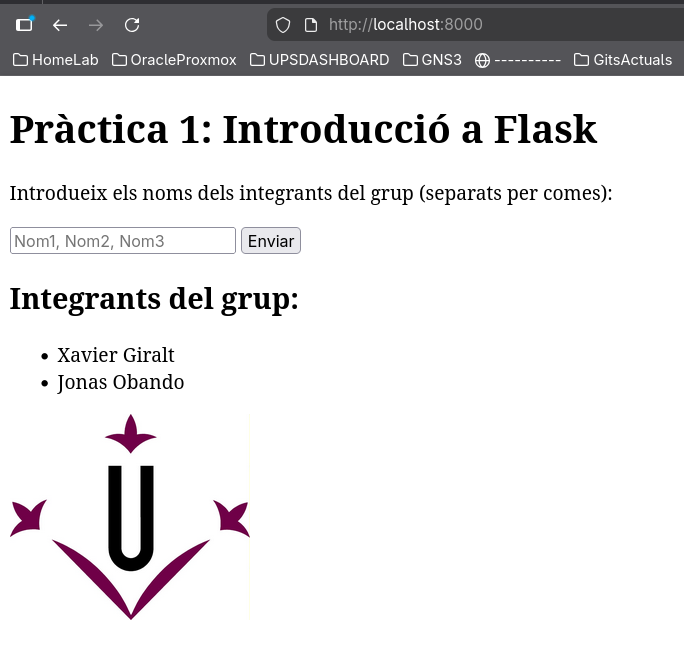

# Practica1-CDA-Flask

### Integrants del Grup:

* Jonas Obando
* Xavier Giralt

### Instruccions per execució local:

1. Crear l'entorn de python i activar-lo:

   `python3 -m venv venv`

   `source venv/bin/activate`
2. Instal·lar depencències:

   `pip install -r requirements.txt`
3. Executar servidor:

   `python3 app.py`
4. Si anem a localhost:8000, hauríem de veure la pàgina correctament:

   

Versió de python: Python 3.14.2
